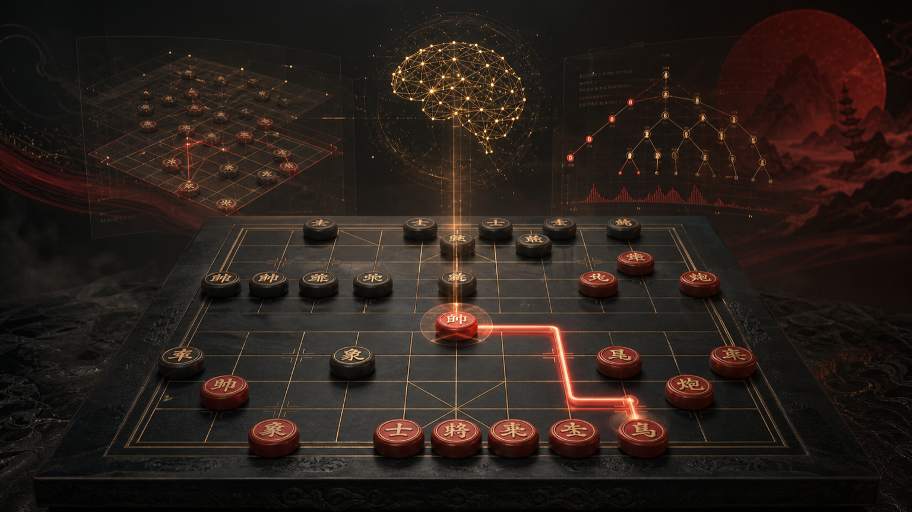
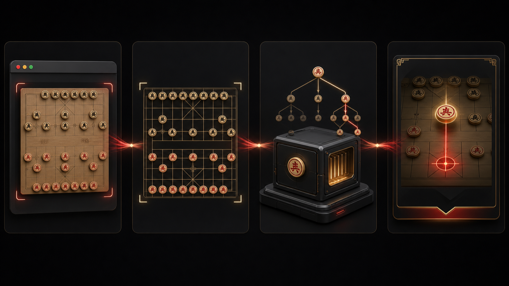

# 象棋助手 · XiangqiAssistant



<div align="center">

### 先看见局面，再读懂那一步。

一款安静常驻于 macOS 菜单栏的中国象棋研究工具：选择棋盘窗口，识别当前局面，在本机快速给出候选着法，并继续深化验证。

**简体中文** · [English](docs/README.en.md) · [日本語](docs/README.ja.md)

[下载 v1.1.0](https://github.com/sunqinji666-dotcom/xiangqi-assistant/releases/latest) · [一分钟上手](#一分钟上手) · [查看工作原理](#从一帧画面到一手建议) · [Star / 收藏](https://github.com/sunqinji666-dotcom/xiangqi-assistant)

</div>

| 当前稳定版 | 支持平台 | 运行方式 | 许可证 | 最后验证 |
|---|---|---|---|---|
| v1.1.0 · Build 2 | macOS 14+ · Apple Silicon | 菜单栏 · 本地运行 | MIT；第三方组件除外 | 2026-07-23 |

## 一盘棋真正需要的，不是更多噪音

棋局改变往往只在一瞬间。你看到局面，却未必来得及把每个棋子抄进分析器；传统引擎又常常要求手工摆盘、切换窗口、等待搜索完成。

象棋助手把这段过程压缩成一个清楚的闭环：你明确选择一个棋盘窗口，它读取画面、确认棋盘、还原局面，再把可信的 FEN 交给本机 Pikafish。约 2 秒时先展示一份可用建议；局面没有变化时，后台继续搜索到约 6 秒；遇到着法反复、分数波动或杀棋线时，最多深化到约 15 秒。

它不是替你下棋的人。它更像坐在棋盘旁边的一位安静研究员：先给方向，再把证据补完整。

## v1.1.0：更快回答，也更谨慎地下结论

### 先有答案，再继续思考

- **快速里程碑**：Ultra 模式约 2 秒发布第一份结果，不必等完整深搜结束。
- **自适应深化**：普通局面继续到约 6 秒；复杂局面最多约 15 秒。
- **结果防串线**：棋盘一旦变化，旧局面的搜索结果不能覆盖新局面。
- **稳定推荐**：分数接近时减少候选着法来回跳动；明显更优或更短杀棋仍会及时更新。

### 开局知识必须经过引擎复核

内置开局库完全离线、只读，并为候选记录来源信息。书库只提供候选，不直接决定最终着法：候选必须合法，并进入 Pikafish 的同局面复核；只有进入引擎前列且差距在安全阈值内，才可能展示。

### 面对真实窗口，而不是理想截图

- 过滤 Dock、控制中心、通知中心等系统窗口，同时保留 Wine、Electron、iOS-on-Mac 等可能承载棋盘的窗口。
- 目标窗口重建或短暂失效时，按稳定身份重新绑定，不偷偷退回整屏捕获。
- 手动框选保存为窗口相对坐标，窗口移动到另一块显示器后仍能复用。
- 自动规范红黑视角，并加强局面合法性、连续帧稳定性和识别诊断。

## 一分钟上手

1. 在 [Releases](https://github.com/sunqinji666-dotcom/xiangqi-assistant/releases/latest) 下载 `XiangqiAssistant-v1.1.0-macOS-arm64.zip`。
2. 解压，把 `象棋助手-TheOne.app` 拖入“应用程序”。
3. 首次打开若 macOS 阻止运行，请在 Finder 中右键应用，选择“打开”。
4. 前往“系统设置 → 隐私与安全性 → 屏幕录制”，允许象棋助手读取你选择的窗口。
5. 打开中国象棋棋盘，点击菜单栏图标，刷新窗口列表并选择目标窗口。
6. 确认棋盘区域；自动定位不理想时使用手动框选，然后开始分析。

> 当前下载包使用固定本地签名，尚未使用 Apple Developer ID 公证。首次运行可能需要手动确认；应用身份保持不变，以减少重新构建后重复申请权限的情况。

## 从一帧画面到一手建议



> 上图为概念示意，不是软件界面截图。

| 阶段 | 做了什么 | 防护边界 |
|---|---|---|
| 选择 | 用户明确选择一个可见应用窗口 | 不默认读取全部屏幕 |
| 捕获 | ScreenCaptureKit 获取目标窗口画面 | 目标失效时不静默换成整屏 |
| 识别 | ONNX 模型定位棋盘并识别 10×9、16 类布局 | 检查棋盘结构、双将与连续帧稳定性 |
| 规范化 | 统一观察方向，生成带行棋方的 FEN | 不把反向棋盘当作另一盘棋 |
| 分析 | Pikafish 通过 UCI 在本机搜索 | 搜索按局面修订号隔离，旧结果作废 |
| 展示 | 输出中文着法、红方视角分数、深度、杀棋距离与主要变化 | 无合法着法被视为终局，不伪装成解析错误 |

## 三种分析节奏

| 模式 | 搜索策略 | 适合 |
|---|---|---|
| 普通 | 单一主线，约 2 秒 | 快速确认当前局面的主要方向 |
| 主动 | 约 3.5 秒分析最多 4 个候选，再做进攻性选择 | 比较更积极的实战方案，同时避免缩短己方败势 |
| 超强 | 2 秒快答 → 6 秒深化 → 复杂局面最多 15 秒 | 复盘、战术局面与杀棋线确认 |

这些时间是程序内的搜索预算，不是对所有机器或局面响应速度的承诺。棋盘识别、窗口状态和系统负载也会影响体验。

## 本地优先，不把棋盘送上云


> 上图为概念示意。当前项目没有云端分析服务。

- 截图、棋盘识别、FEN 生成、开局库和 Pikafish 搜索均在本机完成。
- 不要求象棋平台账号、Cookie、API Key 或云端登录。
- 代码中没有遥测、广告 SDK、云同步和运行时更新检查。
- macOS 屏幕录制权限由系统管理，用户可随时撤销。
- 公开构建明确排除 `UI/AutoPlayManager.swift`，不会点击棋盘或控制鼠标。

## 专业实现

| 层级 | 实现 |
|---|---|
| 应用形态 | SwiftUI + AppKit `NSPanel` 菜单栏应用 |
| 窗口捕获 | Apple ScreenCaptureKit + 目标窗口身份重绑定 |
| 棋盘定位 | TheOne1006 pose ONNX 模型 |
| 局面识别 | TheOne1006 10×9、16 类布局模型 |
| 推理运行时 | Microsoft ONNX Runtime 1.24.2 |
| 局面表达 | 合法性检查、方向规范化、FEN、历史修订号 |
| 棋力分析 | Pikafish 独立进程，通过 UCI 异步通信 |
| 搜索可靠性 | 墙钟超时、EOF/进程退出恢复、取消后 drain、终局处理 |
| 本地知识 | 带来源记录、合法性检查与引擎复核的离线开局库 |
| 目标架构 | Apple Silicon arm64 |
| Bundle ID | `com.xiangqi.XiangqiAssistant.TheOne` |

### 当前明确支持

- 选择窗口、刷新窗口列表和持续观察目标窗口；
- 自动定位棋盘、手动框选和多显示器下的窗口相对校准；
- 正向与反向观察视角的规范化；
- 局面稳定性保护、FEN 生成和历史连续性；
- 普通、主动、超强三种本地分析节奏；
- 中文着法、红方视角分数、深度、杀棋距离和主要变化展示；
- 引擎异常自动恢复与无合法着法终局处理。

### 当前不承诺

- Intel Mac 原生支持；
- 适配所有棋盘皮肤、动画遮挡、缩放比例和特殊变体；
- Apple Developer ID 签名与公证；
- 自动落子、鼠标控制或绕过第三方平台规则；
- 开局库能够覆盖所有开局，或替代引擎独立判断。

请将本项目用于学习、复盘、界面识别研究和离线分析，并遵守所使用平台的规则。

## 从源码构建

要求：macOS 14+、Xcode 15+、Apple Silicon。

```bash
git clone https://github.com/sunqinji666-dotcom/xiangqi-assistant.git
cd xiangqi-assistant
open XiangqiAssistant.xcodeproj
```

在 Xcode 中选择 `XiangqiAssistant` scheme。若本机没有项目使用的固定签名身份，请改用自己的 Apple Development 身份，或执行无签名 Release 构建：

```bash
xcodebuild \
  -project XiangqiAssistant.xcodeproj \
  -scheme XiangqiAssistant \
  -configuration Release \
  -derivedDataPath .build/DerivedData \
  CODE_SIGNING_ALLOWED=NO build
```

### 逻辑验收覆盖

仓库中的 `Tests/BrainLogicHarness.swift` 覆盖窗口候选过滤、反向棋盘规范化、红黑分数与杀棋方向、推荐稳定性、开局库合法性、引擎终局、墙钟超时、搜索取消与替换等关键路径。它是独立逻辑验收程序，不是完整 UI 自动化测试套件。

## 项目结构

```text
Sources/XiangqiAssistant/
├── App/            # 生命周期、菜单栏、识别与分析调度
├── Capture/        # 窗口策略、捕获、重绑定、框选与几何换算
├── Recognition/    # ONNX 识别、模板校准、方向与局面稳定性
├── Engine/         # Pikafish UCI、自适应搜索、开局库与着法策略
├── UI/             # 浮窗、棋盘预览和状态展示
└── Resources/      # 引擎、NNUE、ONNX 模型与离线开局库
```

## 下载与校验

正式安装包和校验文件位于 [GitHub Releases](https://github.com/sunqinji666-dotcom/xiangqi-assistant/releases/latest)。

```bash
shasum -a 256 -c XiangqiAssistant-v1.1.0-macOS-arm64.zip.sha256
```

校验成功会显示 `OK`。如果文件名、大小或摘要与 Release 页面不一致，请不要运行该安装包。

## 第三方组件与许可证

原创源码使用 MIT License。Pikafish、ONNX Runtime 和 TheOne1006 模型保留各自许可证或使用条款，不因本仓库采用 MIT 而改变。特别是 Pikafish 的再分发和修改受 GPLv3 约束；模型文件的来源与再分发边界请阅读 [THIRD_PARTY_NOTICES.md](THIRD_PARTY_NOTICES.md)。

## 路线图与贡献

- 扩充经过来源审计与引擎复核的开局知识；
- 提升更多棋盘皮肤、缩放和窗口框架的识别兼容性；
- 增加可复现的固定局面回归样本；
- 在具备正式证书后补齐 Developer ID 签名与公证。

欢迎通过 GitHub Issue 提交可复现的问题、棋盘兼容信息和改进建议。请勿在公开 Issue 中上传账号、私人截图、Cookie 或其他敏感数据。

**Jacksun** · [qinji@jack-sun.com](mailto:qinji@jack-sun.com)

如果它帮助你看清了一盘棋，欢迎 [Star / 收藏这个项目](https://github.com/sunqinji666-dotcom/xiangqi-assistant)。
