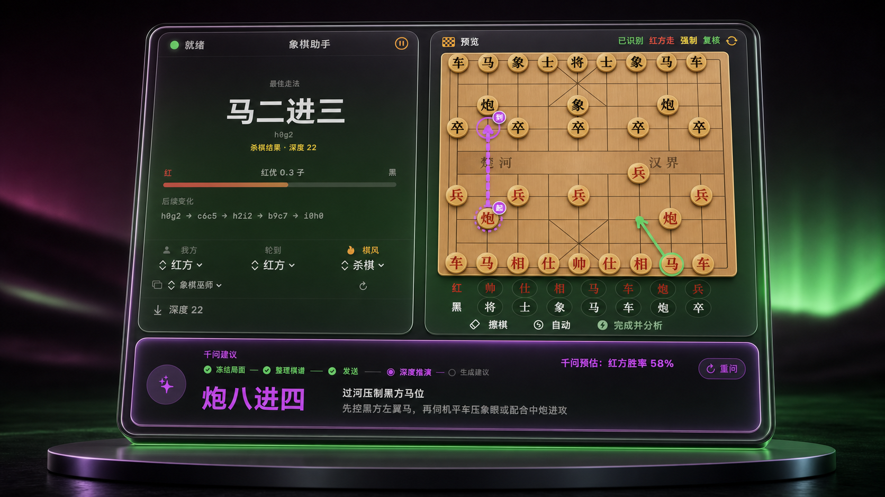
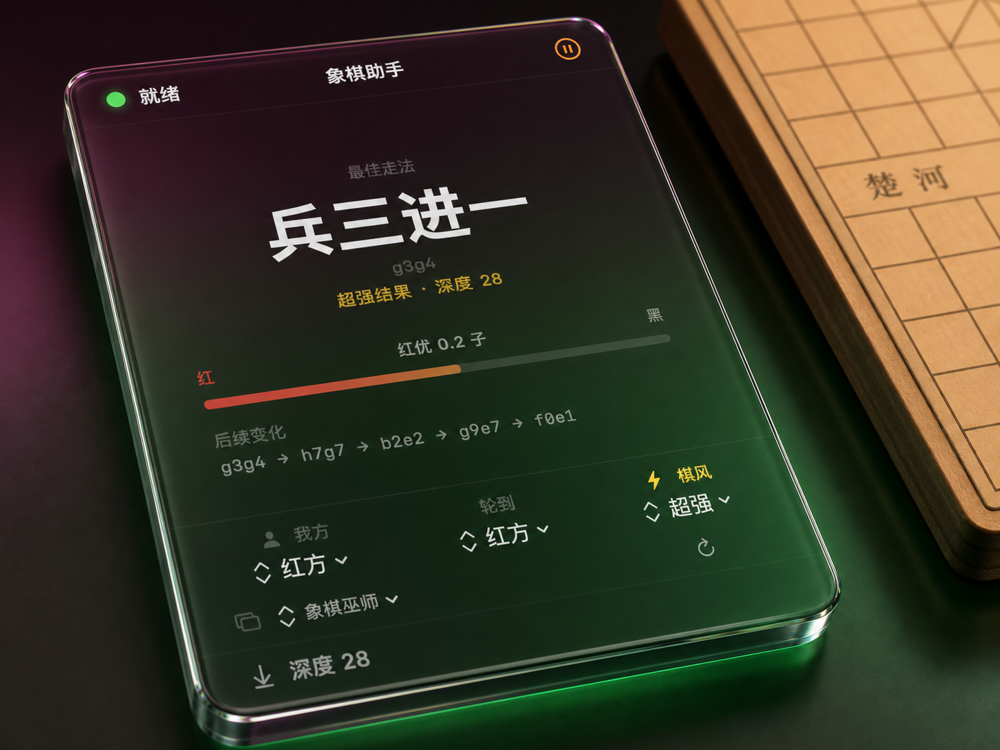
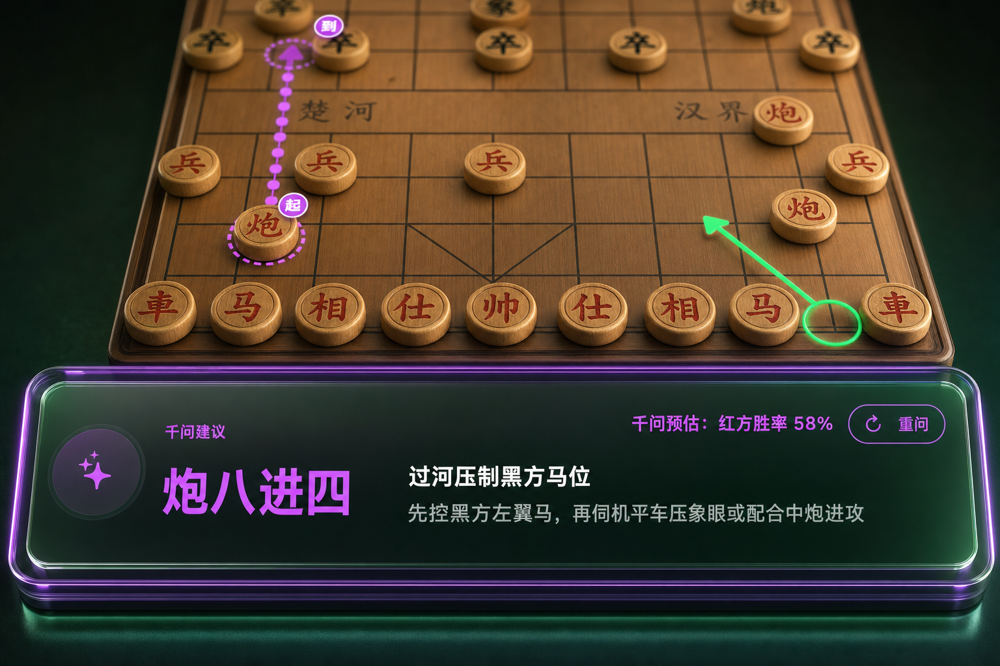
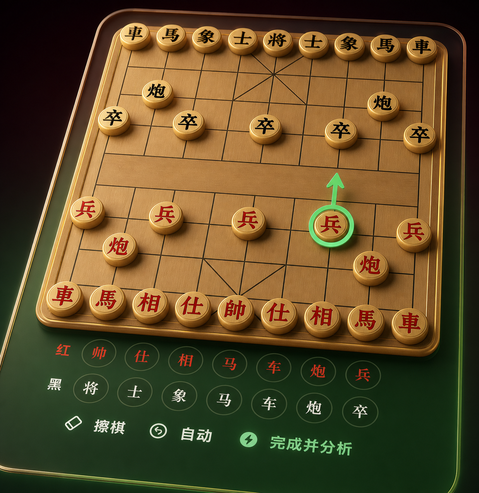

# XiangqiAssistant


<div align="center">

### See the position. See the next move.

A macOS menu-bar companion for Chinese-chess analysis: select a board window, reconstruct the position, and analyse it with local Pikafish. Optional Qwen ideas are verified locally before display.

[简体中文](../README.md) · **English** · [日本語](README.ja.md)

[Download v1.3.1](https://github.com/sunqinji666-dotcom/xiangqi-assistant/releases/latest) · [Quick start](#quick-start) · [Star the project](https://github.com/sunqinji666-dotcom/xiangqi-assistant)

</div>

| Current release | Platform | License |
|---|---|---|
| v1.3.1 · Build 5 | macOS 14+ · Apple Silicon | MIT (third-party exceptions) |

## What it does



- Reads only the board window you explicitly choose, then recognizes the board and position.
- Uses local Pikafish for candidate moves, evaluation, depth, and principal variation.
- Offers Normal, Aggressive, and Ultra analysis; unchanged positions can continue to deepen.
- Supports manual board selection, piece correction, orientation flip, and per-client calibration.
- Optional Qwen advice proposes independent plans, then a separate local Pikafish flow checks legality and obvious tactical risk.

## Two perspectives, one board

| Local engine analysis | Independent Qwen advice |
|---|---|
|  |  |
| Pikafish provides a main line and evaluation. | It does not receive the green engine recommendation first; up to three plans are locally verified. |



## Quick start

1. Download `XiangqiAssistant-v1.3.1-macOS-arm64.zip` from [Releases](https://github.com/sunqinji666-dotcom/xiangqi-assistant/releases/latest).
2. Unzip it and move `象棋助手-TheOne.app` to Applications.
3. If macOS blocks the first launch, right-click the app in Finder and choose **Open**.
4. Allow the app in **System Settings → Privacy & Security → Screen Recording**.
5. Open a Xiangqi board, click the menu-bar icon, refresh the window list, and choose the target. Use manual selection when needed.

> The package targets Apple Silicon and uses a persistent local signature; it is not Apple Developer ID notarized. Qwen requires your own API key, stored only in the app sandbox at `Application Support/象棋助手/ModelCredentials/qwen-dashscope`. No credential is included in this repository or package.

## Local and deliberate

- Captures, board recognition, FEN generation, opening data, and Pikafish search run locally.
- No chess-platform account, Cookie, cloud login, telemetry, ad SDK, cloud sync, or runtime update check is required.
- The app does not silently fall back to full-screen capture.
- The public build contains no automatic move or mouse-control behavior. Follow the rules of the platform you use.

## Build from source

Requires macOS 14+, Xcode 15+, and Apple Silicon.

```bash
git clone https://github.com/sunqinji666-dotcom/xiangqi-assistant.git
cd xiangqi-assistant
open XiangqiAssistant.xcodeproj
```

If the local signing identity is unavailable, select your own Apple Development identity in Xcode or build unsigned:

```bash
xcodebuild -project XiangqiAssistant.xcodeproj -scheme XiangqiAssistant \
  -configuration Release -derivedDataPath .build/DerivedData \
  CODE_SIGNING_ALLOWED=NO build
```

`Tests/BrainLogicHarness.swift` covers core logic including window filtering, orientation, frame stability, score perspective, recommendation stability, engine timeout, and terminal positions. It is not a complete UI test suite.

## Download and license

- Packages and SHA-256 files: [GitHub Releases](https://github.com/sunqinji666-dotcom/xiangqi-assistant/releases/latest).
- Original code: [MIT License](../LICENSE). Pikafish, ONNX Runtime, and TheOne1006 models retain their own terms; see [THIRD_PARTY_NOTICES.md](../THIRD_PARTY_NOTICES.md).
- File reproducible issues or compatibility reports through Issues. Do not post accounts, Cookies, private screenshots, or secrets.

[Jacksun](https://github.com/sunqinji666-dotcom) · [qinji@jack-sun.com](mailto:qinji@jack-sun.com)
